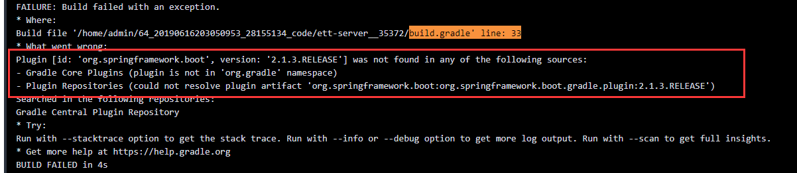

### openjdk8安装后，运行gradle时有如下错误：

```
org.apache.http.ssl.SSLInitializationException: /usr/lib/jvm/java-8-openjdk-amd64/jre/lib/security/cacerts (No such file or directory)
```
ref
- [Is the cacerts file missing in ubuntu 15.10 and openjdk-8-jdk?](https://stackoverflow.com/questions/33439905/is-the-cacerts-file-missing-in-ubuntu-15-10-and-openjdk-8-jdk)

这是一个bug：
[ca-certificates-java doesn't create /etc/ssl/certs/java/cacerts](https://bugs.launchpad.net/ubuntu/+source/ca-certificates-java/+bug/1396760)

要解决这个问题，执行如下命令：
```
$ sudo dpkg --purge --force-depends ca-certificates-java
$ sudo apt-get install ca-certificates-java
```

### 在aliyun云效中自定义构建镜像，运行gradle时有如下错误：


ref:
- [(已解决)错误：Plugin [id: 'org.springframework.boot', version: '2.1.4.RELEASE'] was not found](https://blog.csdn.net/qq_27637361/article/details/89684083)
- [org.springframework.boot plugin](https://plugins.gradle.org/plugin/org.springframework.boot)

解决方法：
由`plugins DSL`换为` legacy plugin application`:
```
buildscript {
  repositories {
    maven {
      url "https://plugins.gradle.org/m2/"
    }
  }
  dependencies {
    classpath "org.springframework.boot:spring-boot-gradle-plugin:2.1.3.RELEASE"
  }
}

apply plugin: "org.springframework.boot"
```
